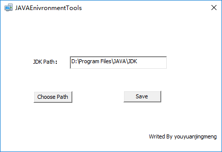
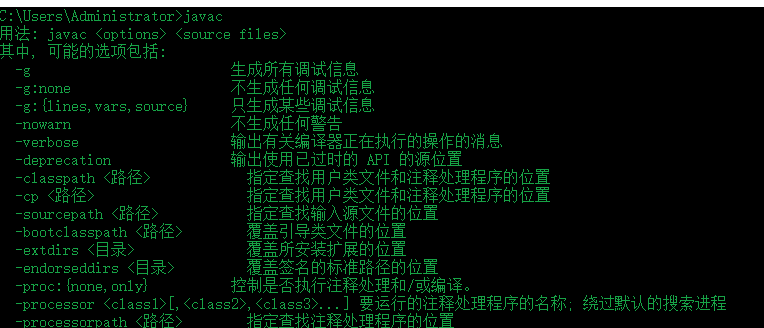

JDKSetupTool
======================
A tools for you to config Java environment automatically...  
解放双手，每次重装系统之后不用再为设置Java环境变量而去google、baidu......

## 用法:
1. 安装jdk（请自行google安装包地址）；  
2. 运行\Release目录下的JAVAEnivronmentTools.exe（需要管理员权限）；  
3. 点击Choose按钮，选择JDK安装目录；  
4. 点击Save按钮保存即可完成Java环境变量的设置；  
5. cmd环境下输入 java -c， java -version ，查看是否设置成功。  

  

